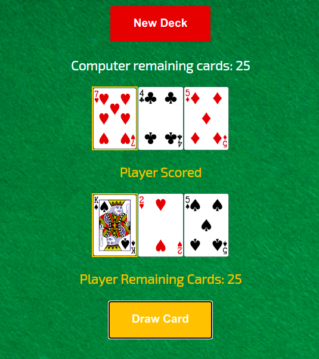

# A War Game (Card Game) Created By Pure JavaScript

- The objective of the game is to win all of the cards.

- Each player has 26 cards. The player with the higher card takes both of the cards played and moves them to their stack.

- If the two cards played are of equal value, then there is a war. Both players place the next three cards. The player with the higher card takes both of the cards played and moves them to their stack. (According to the last cards) If the last cards are again equal then the battle repeats with another set of two more cards. This repeats until someone's last card is higher than their opponent's.

- If a player runs out of cards during a war, the player immediately loses.

## Built With

- HTML, CSS, JavaScript

## Live

[Snake Game ](https://emirsagit.github.io/war-game/)

## Getting Started

To get a local copy up and running first you need to clone the repo. After that, open index.html with your browser. It's a browser game. You can play it locally as soon as open index.html file.

## Authors

👤 **Emir Sağıt**

- GitHub: [@emirsagit](https://github.com/emirsagit)
- Twitter: [@emirsagit](https://twitter.com/emirsagit)
- LinkedIn: [Emir Sağıt](https://www.linkedin.com/in/emir-sa%C4%9F%C4%B1t-633035188/)

## Thanks

Inspired from [Scrimba](https://scrimba.com/) lesson. I personally recommend it to everyone who wants to be a front-end developer. THe project used [Deckofcardsapi](https://deckofcardsapi.com/) API for getting random cards and images.

## 🤝 Contributing

Contributions, issues, and feature requests are welcome!

Feel free to check the [issues page](../../issues/).

## Show your support

Give a ⭐️ if you like this project!

## 📝 License

This project is [MIT](./MIT.md) licensed.
